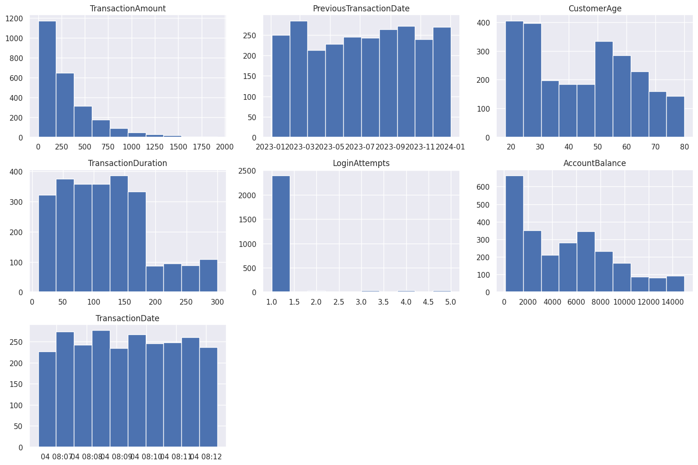
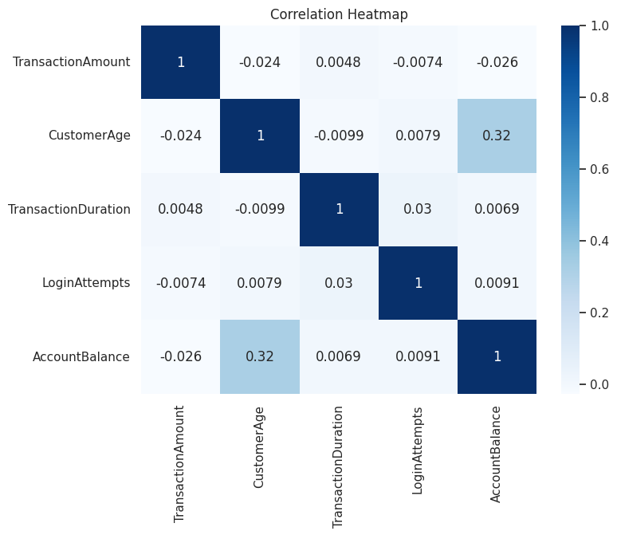
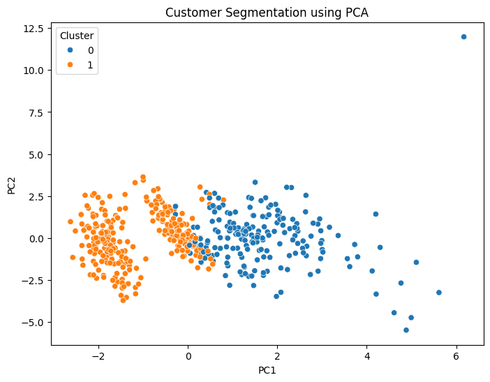

# Customer Financial Behavior Analysis for Banking Business Intelligence


---

## Project Overview

This project analyzes customer financial behavior using banking transaction data to generate actionable business insights. The project follows the CRISP-DM methodology, covering data understanding, data cleaning, exploratory data analysis, feature engineering, customer segmentation using K-Means Clustering, cluster profiling, and business recommendations.

---

## Business Problem

Financial institutions manage large volumes of customer transaction data every day. Without proper analysis, banks may struggle to identify customer behavior patterns, resulting in less effective marketing strategies and customer engagement.

This project aims to identify customer segments based on financial behavior and provide business recommendations to support data-driven decision making.

---

## Project Objectives

- Understand customer financial behavior.
- Clean and prepare banking transaction data.
- Perform exploratory data analysis.
- Engineer customer behavior features.
- Segment customers using K-Means Clustering.
- Analyze customer profiles.
- Generate business insights and recommendations.

---

## Dataset

The dataset contains anonymized banking transaction records.

| Information | Value |
|------------|------:|
| Total Transactions | 2,402 |
| Total Customers | 495 |
| Total Features | 16 |

Main variables include:

- Transaction Amount
- Account Balance
- Transaction Type
- Transaction Date
- Customer Age
- Banking Channel
- Login Attempts
- Transaction Duration

---

## Technologies

- Python
- Pandas
- NumPy
- Matplotlib
- Seaborn
- Scikit-Learn
- Jupyter Notebook
- Google Colab

---

## Project Workflow

```
Business Understanding
        ↓
Data Understanding
        ↓
Data Cleaning
        ↓
Exploratory Data Analysis
        ↓
Feature Engineering
        ↓
Data Preprocessing
        ↓
Customer Segmentation
        ↓
Cluster Profiling
        ↓
Business Insight & Recommendation
```

---

## Repository Structure

```
Customer-Financial-Behavior-Analysis/

│
├── data/
│
├── images/
│
├── notebooks/
│   ├── 01_Data_Understanding.ipynb
│   ├── 02_Data_Cleaning_Full.ipynb
│   ├── 03_Exploratory_Data_Analysis_Full.ipynb
│   ├── 04_Feature_Engineering_Full.ipynb
│   ├── 05_Data_Preprocessing_Full.ipynb
│   ├── 06_Customer_Segmentation_KMeans_Full.ipynb
│   ├── 07_Cluster_Profiling_Full.ipynb
│   └── 08_Business_Insight_Recommendation.ipynb
│
├── README.md
├── requirements.txt
└── LICENSE
```

---

## Exploratory Data Analysis

The exploratory analysis includes:

- Missing Value Analysis
- Duplicate Detection
- Descriptive Statistics
- Distribution Analysis
- Correlation Analysis

### Distribution of Numerical Features



### Correlation Heatmap



---

## Feature Engineering

Several customer-level features were created to better represent financial behavior.

- Average Transaction
- Average Balance
- Debit Count
- Credit Count
- Debit Ratio
- Credit Ratio
- Favorite Channel
- Favorite Merchant
- Total Transactions per Account

---

## Customer Segmentation

Customer segmentation was performed using the K-Means clustering algorithm.

### Elbow Method


### Silhouette Analysis


### PCA Visualization



---

## Cluster Profiling


| Feature | Cluster 0 | Cluster 1 |
|---------|----------:|----------:|
| Transaction Amount | Higher | Lower |
| Account Balance | Higher | Lower |
| Debit Ratio | Lower | Higher |
| Credit Ratio | Higher | Lower |
| Transaction Activity | Higher | Lower |

---

## Business Insights

### Cluster 0 – Credit-Oriented High Activity Customers

- Higher transaction amount and account balance.
- Higher transaction activity.
- High credit ratio.
- Suitable for premium banking products.

### Cluster 1 – Debit-Oriented Low Activity Customers

- Lower account balance.
- Lower transaction activity.
- Higher debit ratio.
- Suitable for retention and loyalty campaigns.

---

## Business Recommendations

| Cluster | Strategy |
|----------|----------|
| Cluster 0 | Priority Banking, Wealth Management, Investment Products |
| Cluster 1 | Cashback Campaign, Loyalty Program, Digital Banking Promotion |

---

## Business Value

This project can support:

- Customer Segmentation
- Personalized Marketing
- Customer Retention
- Product Recommendation
- Business Intelligence
- Strategic Decision Making

---

## Future Improvements

- DBSCAN Clustering
- Hierarchical Clustering
- Churn Prediction
- Fraud Detection
- Power BI Dashboard
- Customer Lifetime Value Prediction

---

## Installation

```bash
git clone https://github.com/username/Customer-Financial-Behavior-Analysis.git

cd Customer-Financial-Behavior-Analysis

pip install -r requirements.txt

jupyter notebook
```

---

Data Analyst | Data Scientist | Business Intelligence
